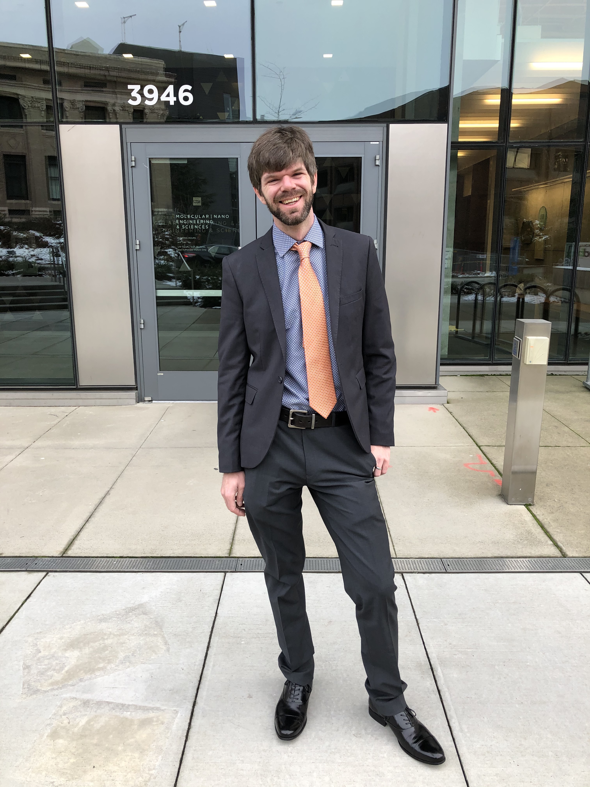

## Summary
I am a data scientist, who is passionate about looking at signals in data to understand
complex global challenges.

I am defended my PhD in chemical engineering with a concentration in data science at
 University of Washington. My PhD research involves applying machine learning to improve efficiency and stability of solar cells.

Check out some of my recent work in the [Projects](projects.md) and
[Publications](publications.md) tabs.

I currently live in Seattle with my wife Kristin, and enjoy running, climbing, skiing, peakbagging, dancing, and cooking spicy food

