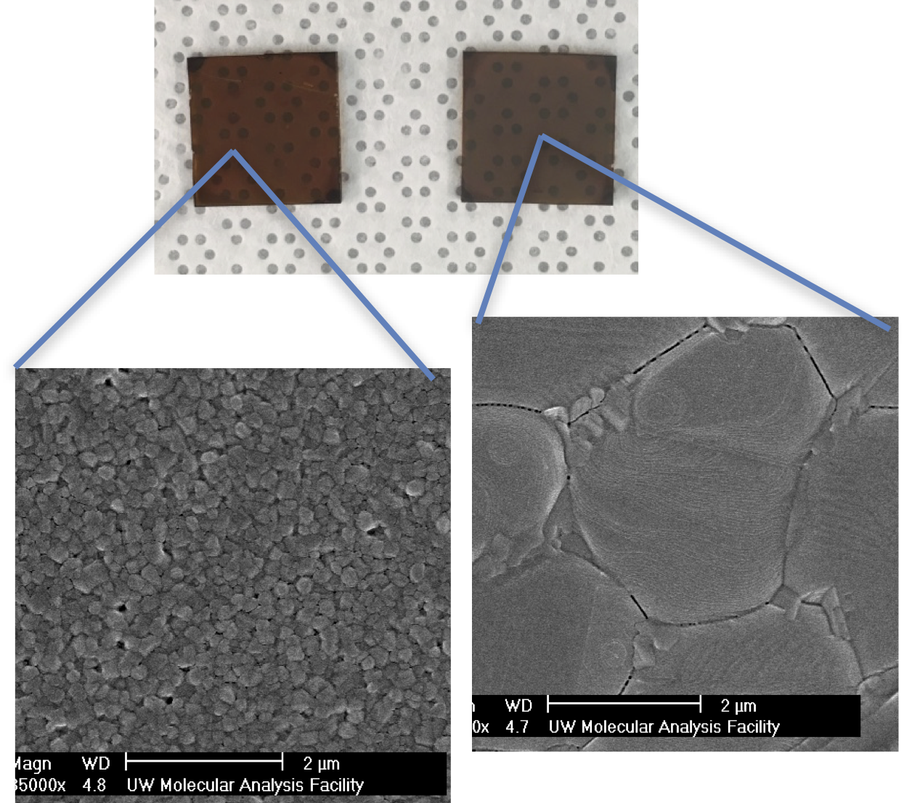

## Summary
I am a data scientist, interested in leveraging signals in various datasets to impact society.
Currently I am pursuing my PhD in chemical engineering (with Advanced Data Science option) at
 University of Washington.

My PhD research involves applying machine learning to improve efficiency and stability of solar cells

Check out some of my recent work in the [Projects](projects.md) and
[Publications](publications.md) tabs.

I spend my free time exploring the outdoors, check out my adventures in the
[Personal](personal.md) tab