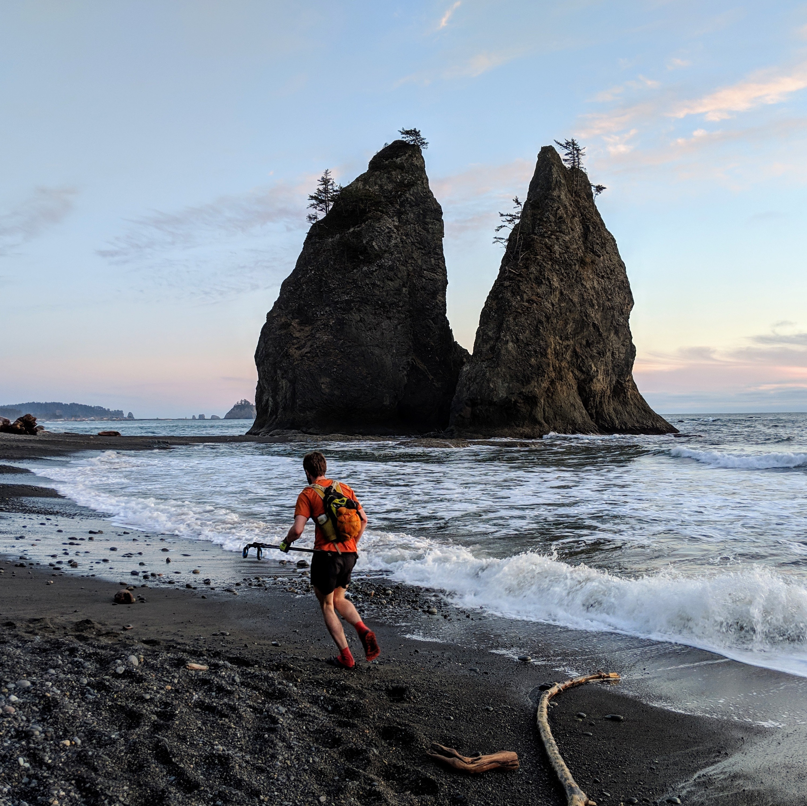

## Summary
I am a passionate adventurer, and typically spend my free time outside with like-minded people

## Volunteer
I have volunteered for 4 years as an instructor with Outdoors For All, providing outdoor recreation
opportunities with folks of all ages with disabilities. The community at OFA is incredible, and I am
always overwhelmed by how much I learn from my students and their families.

## Adventure
### Mountaineering
I am an aspiring alpinist. I climb to push my own mental and physical limits, and to have rich and meaningful
experiences with my climbing partners. In an ever complex society where everyone leads their own lives, it is 
incredibly refreshing how raw of experience can be had exploring the mountains with friends. Check out some of my
[Trip Reports](http://www.nwhikers.net/forums/search.php?search_id=TR&search_author=rstoddard24) or my progress on 
[WA's top 100 summits](https://peakbagger.com/map/BigMap.aspx?miny=46.1914178&maxy=48.997601&minx=-122.195606&maxx=-119.97057&l=GT&t=L&d=5003&c=17247&bl=0)

### Ultrarunning
I am a "soul runner", that is I love for the joy of it and to recharge. Check out some of my [race results](https://ultrasignup.com/results_participant.aspx?fname=Ryan&lname=Stoddard)
