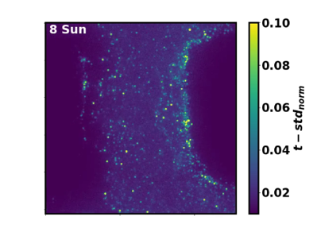
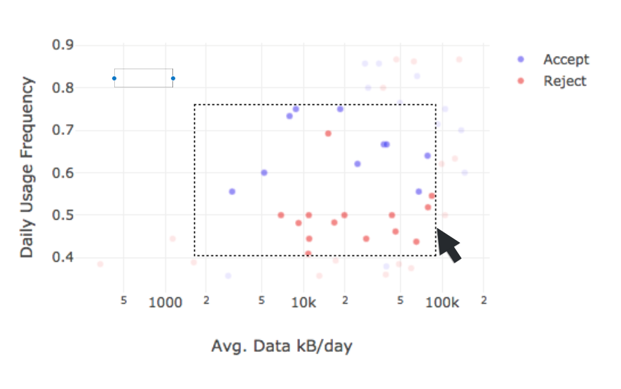
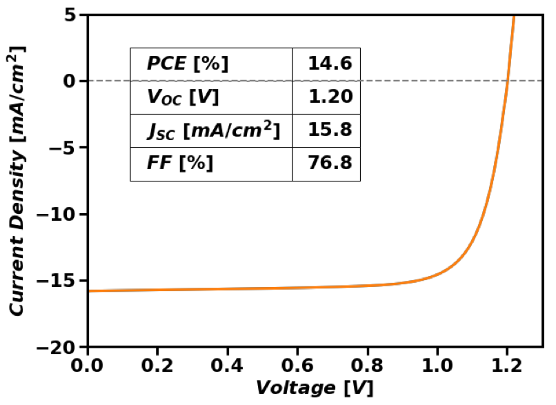

## Hybrid Perovskite Material Quality Database
I initiated using high throughput experiments to collect the Hybrid Perovskite Database
(hp-db). I used machine learning models with the hp-db to link composition to material properties -
 this work led to discovery of new materials that exhibited world-record device open-circuit voltage 
 (learn more [here](https://pubs.acs.org/doi/10.1021/acsenergylett.8b00576))

## Time Series Forecasting of HP Solar Cell Stability
I developed tools for timeseries forecasting of solar cell stability using photoluminescence video datasets. 
This work helped secure $1.5M in Department of Energy funding to enhance the operational stability
of perovskite solar cells. 	

## DeepQL:
For my databases term project, I developed DeepQL in collaboration with one other student. DeepQL is 
an SQL-style language that interfaces with a neural network to ask "what if questions" of the prediction
space. We demonstrated DeepQL on a neural network we trained with H1B visa dataset (~500k rows) - with this network,
DeepQL can ask questions like "if my gender was different, would my visa have been denied?" 
or "if my salary was 10% higher, would my H1B visa have been approved?"

## Amplerodeo:
For my data visualization class, I developed "Amplerodeo", a data visualization dashboard
for time-series data in collaboration with a team of 4 students and [Amplero](https://www.amplero.com/)
	

## PVtools research analysis suite
I developed python data analysis tools for doing routine data analysis for all aspects of photovoltaic materials research:
including current-voltage, external quantum efficiency, X-ray diffraction, photoluminescence, and carrier diffusion length
measurements. My software suite is now used by other PV researchers at UW 	

## SunDial: project
For my Software Development for Data Scientists class, I developed "[SunDial](https://github.com/UWSEDS-aut17/SunDial)" with a team of 4 students, a tool for maximizing profits by performing
arbitrage with clean tech resources. In other words, SunDial looks at energy price data and weather data and determines if 
profits from cycling a battery are worth the expected degradation for each cycle.
